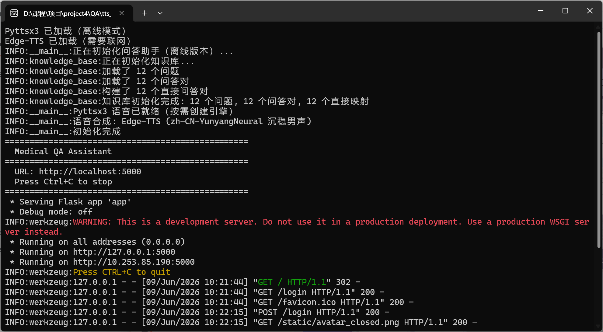
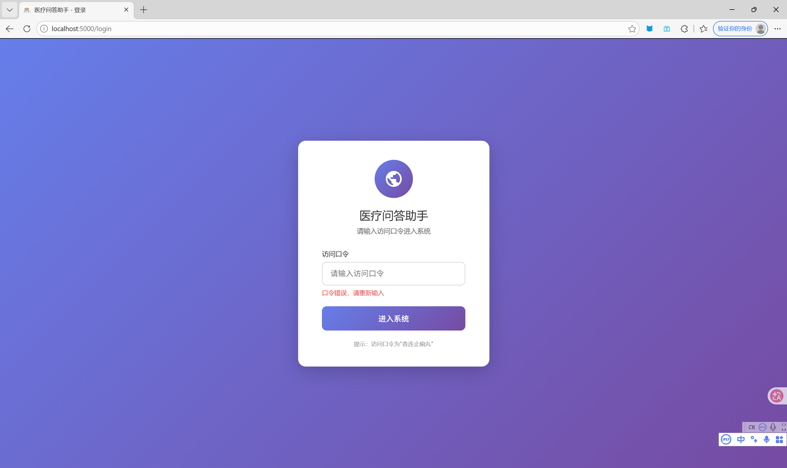
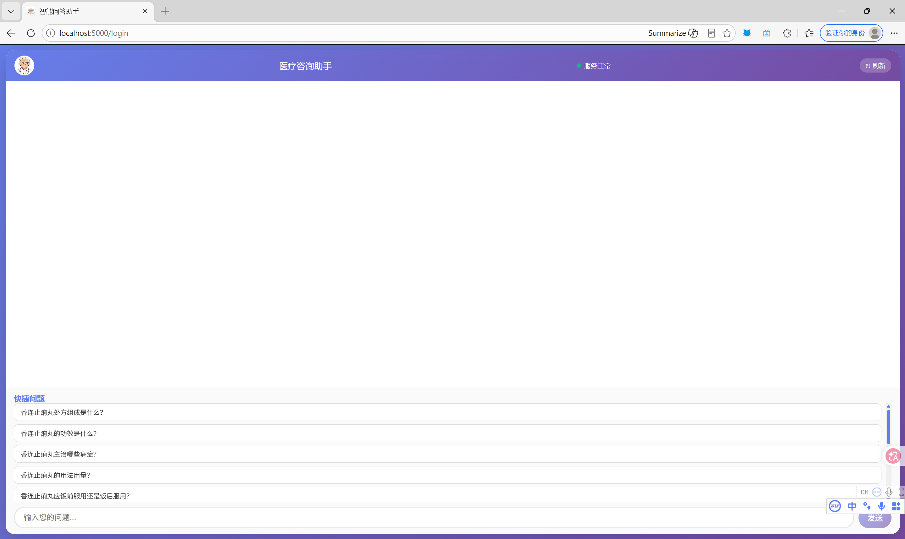
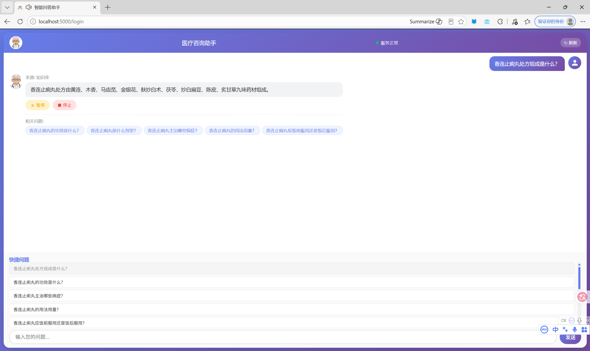

# QA 问答项目

## 项目简介
这是一个前后端结合的问答应用，包含前端交互界面与后端服务模块。

---

## 项目效果预览

### 后端服务页面

### 前端交互界面

---

## 快速启动指南

### 1. 启动后端服务
1.  进入项目目录下的 `tts_offline_server/dist/` 文件夹
2.  双击运行目录内的 `.exe` 可执行文件，启动后端服务
3.  等待服务启动完成（可参考 `img/0.png` 中的后端运行界面）

### 2. 访问前端界面
后端服务启动成功后，打开浏览器访问前端页面，即可使用项目功能。

---
